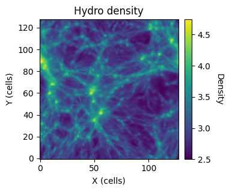

Running a test calculation on Lux
=====
Setup + Compilation
----------

After cloning Cholla, we will need to update a few things (as of 6/20/2024).

1. In ``cholla/builds/make.type.hydro``, we need to make sure that the spatial reconstruction method is PPMP (not PLMC, which fails on Lux with this version of the code). This is the third flag down. 

We also need to add some setup and host files. These can all be found in ``cholla-cosmo/docs/setup_files``.

2. Add ``setup.lux.sh`` to the cholla/ directory:

.. literalinclude:: ../setup_files/setup.lux.sh
  :language: shell

3. Add ``make_cholla.sh`` to the cholla/ directory:

.. literalinclude:: ../setup_files/make_cholla.sh
  :language: shell

4. Add ``make.host.lux`` to the cholla/builds/ directory:

.. literalinclude:: ../setup_files/make.host.lux
  :language: text

5. In the cholla/ directory, run

``source setup.lux.sh``

``sh make_cholla.sh``

You should now have ``cholla.cosmology.lux`` in cholla/bin/.

6. Create a directory outside of cholla/ to run the test calculation in. We'll call this run/

In the run/ directory:

7. Add ``run.sh``:

.. literalinclude:: ../setup_files/run.sh
  :language: shell

8. Add parameter_file.txt

.. literalinclude:: ../setup_files/parameter_file.txt
  :language: text

If the path for scale_outputs_file and UVB_rates_file is not working, there is a copy of the input directory in which these files are located in this repo, in ``cholla-cosmo/docs/setup_files/input``.

9. Link the executable (still within the /run directory): ``ln -s /path-to-cholla/cholla/bin/cholla.cosmology.lux``

10. Create an output directory, ``data``.

11. Run the code

After getting a GPU node on Lux, and ensuring that we are in the run/ directory, we can run the code by using ``./run.sh``

See ``cosmo-cholla/setup_files/gpuq.sh`` for an example of how to get a node on Lux.

Outputs
------

After the simulation is complete (~ 1 minute), there will be one set of outputs (in run/data/1). In general, a directory will be created inside of the ``run/data`` directory for each output time given in the scale outputs file. Here we find six hdf5 files:

- 1_gravity.h5.0
- 1_gravity.h5.1
- 1.h5.0
- 1.h5.1
- 1_particles.h5.0
- 1_particles.h5.1

As there is one type of output (gravity, hydro, particles) per processor, we need to concatenate each type. This can be done by using the python scripts provided in the main Cholla repo, within ``cholla/python_scripts``. If you have the files concat_3d_data.py, concat_internals.py, and concat_particles.py from ``cholla/python_scripts`` either in your run directory or added to your path, you can run the concatenation with ``sbatch concat_h5.sbatch``.

concat_h5.sbatch is provided below and also included in ``cholla-cosmo/docs/visualizations``.

.. literalinclude:: ../visualizations/concat_h5.sbatch
  :language: sbatch

Note that NUM is set to 1 as there was only one output time, and we set -n 2 as there were two processors.

This will concatentate 1.h5.0 and 1.h5.1 into 1.h5, the complete hydro data file. 1_particles.h5.0 and 1_particles.h5.1 will be concatentated into 1_particles.h5, the complete particle data file. From here, we can visualize the results. An example notebook is provided in ``cholla-cosmo/docs/visualizations`` and the density projection along the z-axis of the hydro data is shown below.

