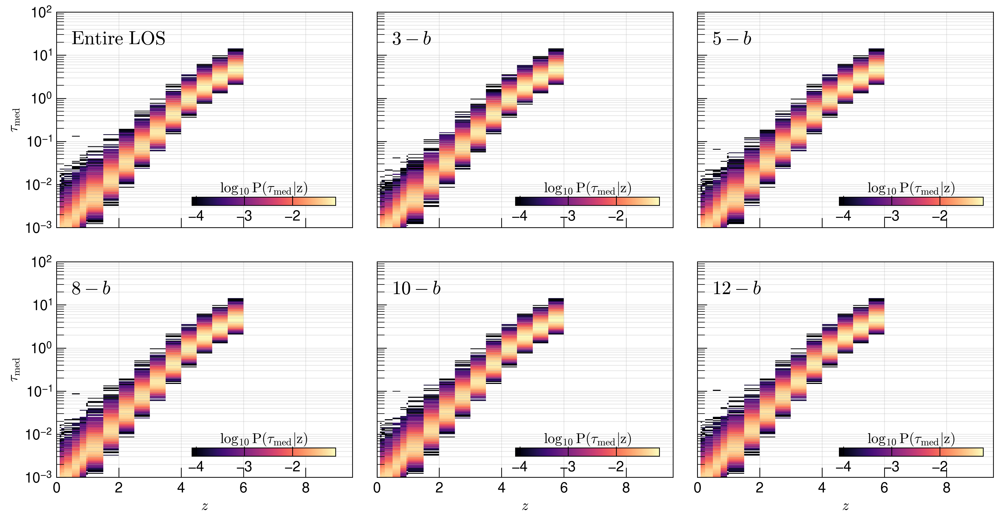
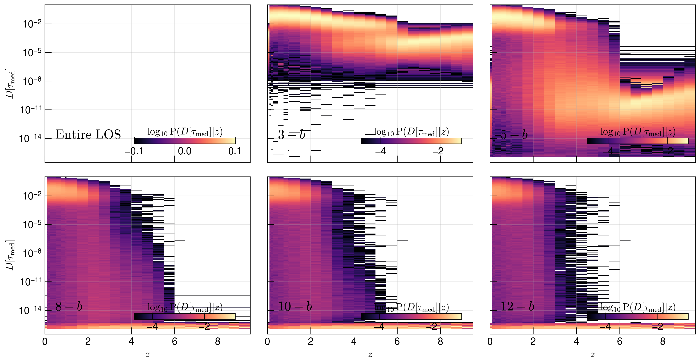
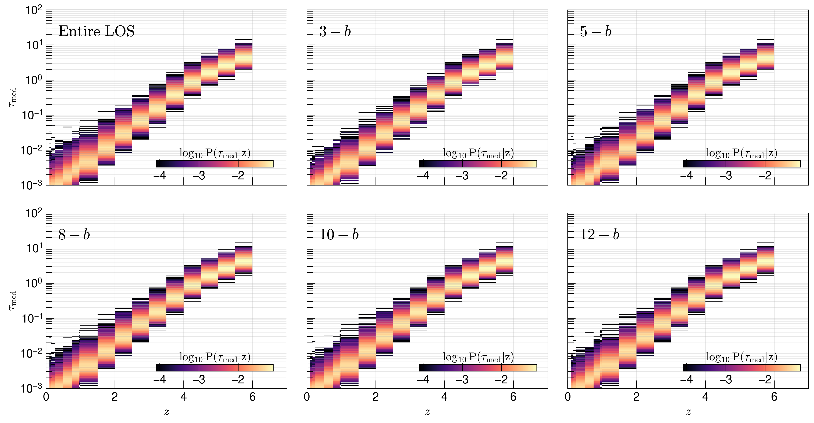
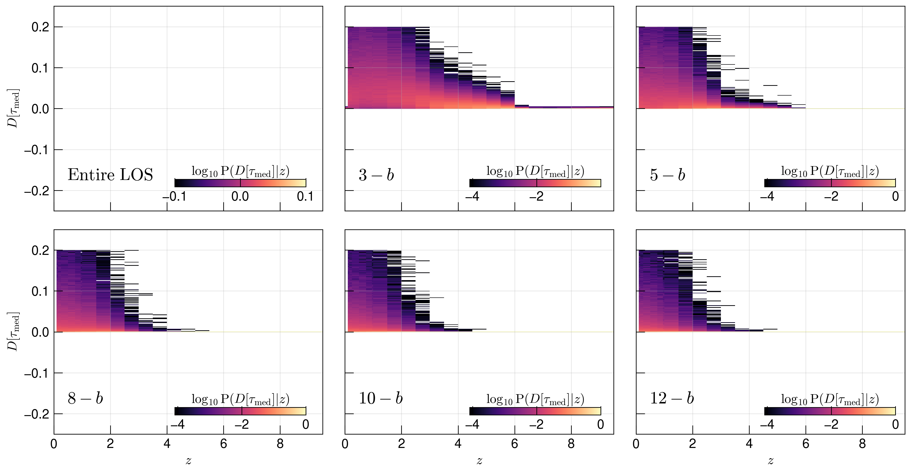
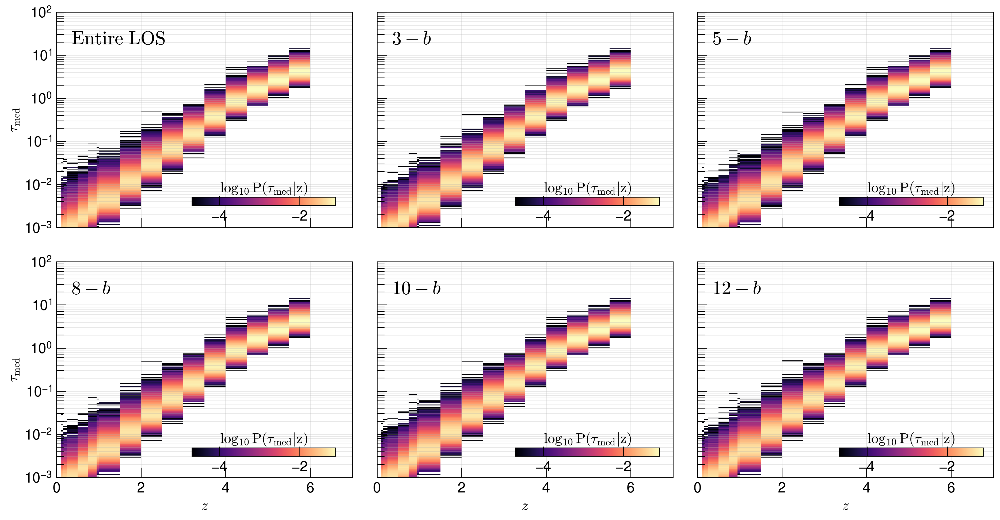
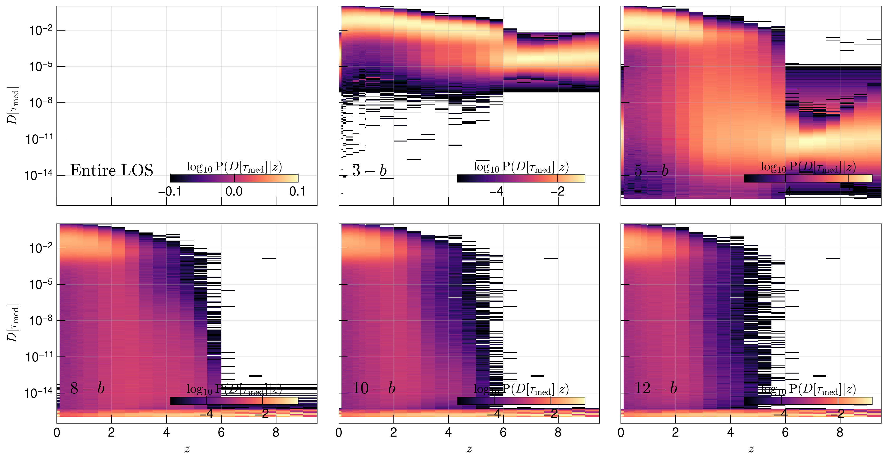

.. _study-gauss-speed:
Gaussian Optical Depth Speedup
=====

.. _email_diego: digarza@ucsc.edu

.. _Overview:
Overview
-----------

Most of the motivation comes from :ref:`opt-depth`. 

In this study, we look at a couple factors:

1. How does the on-the-fly flux power spectrum (from analysis files) compare with the post-simulation flux power spectrum for different number of :math:`v_{\textrm{th}}` units around the mean?
2. How does the mean flux and mean optical depth change for different number of :math:`v_{\textrm{th}}` units around the mean?
3. How does the average calculation time per skewer change for different number of :math:`v_{\textrm{th}}` units around the mean?
4. How does the total calculation time at some snapshot change for different number of :math:`v_{\textrm{th}}` units around the mean?
5. How does the relative difference of the optical depth from using the entire line of sight and using this speedup method change for different number of :math:`v_{\textrm{th}}` units around the mean?

We are also interested in seeing how these vary with the number of skewers that are used in the calculation -- inputed into the Cholla param file with `n_stride`.

The code to generate this study is found `here <https://github.com/astrodiegog/cholla_lya_scripts/tree/speedup-study>`_.

This study was calculated on lux and the outputs can be found `/data/groups/comp-astro/digarza/optdepth_skewtest`.

To study these effects with respect to resolution and skewer count, we run a total of 6 :math:`L=50 h^{-1} \rm{Mpc}` simulations with the same `Planck 2018 <https://ui.adsabs.harvard.edu/abs/2024arXiv240403002D/abstract>`_ cosmology:

1. :math:`512^3` cells & `lya_skewers_stride=16` :math:`\rightarrow 3072` skewers
2. :math:`512^3` cells & `lya_skewers_stride=8` :math:`\rightarrow 12288` skewers
3. :math:`512^3` cells & `lya_skewers_stride=4` :math:`\rightarrow 49152` skewers
4. :math:`1024^3` cells & `lya_skewers_stride=16` :math:`\rightarrow 12288` skewers
5. :math:`1024^3` cells & `lya_skewers_stride=8` :math:`\rightarrow 49152` skewers
6. :math:`1024^3` cells & `lya_skewers_stride=4` :math:`\rightarrow 196608` skewers

We set skewer outputs at the following redshifts: 10. ,  9.5 ,  9. ,  8.5 ,  8. ,  7.5 ,  7. ,  6.5 ,  6. , 5.5 ,  5. ,  4.5 ,  4. ,  3.5 ,  3. ,  2.5 ,  2. ,  1.5 , 1. ,  0.95,  0.75,  0.5 , 0.25,  0.15, 0.1 , 0.05.

Flux Power Spectrum Results
----------------------------

For each skewer output we 1) calculate the local optical depth, 2) calculate the flux power spectrum, and 3) calculate the relative difference against the on-the-fly flux power spectrum, showing the effect of using the following optical depth methods

1. Use the entire line of sight
2. Use cells falling within :math:`3-v_{\textrm{th}}` of cell-centered Hubble flow velocity
3. Use cells falling within :math:`5-v_{\textrm{th}}` of cell-centered Hubble flow velocity
4. Use cells falling within :math:`8-v_{\textrm{th}}` of cell-centered Hubble flow velocity
5. Use cells falling within :math:`10-v_{\textrm{th}}` of cell-centered Hubble flow velocity
6. Use cells falling within :math:`12-v_{\textrm{th}}` of cell-centered Hubble flow velocity

The full results are shown in the lux directory, so I will summarize by plotting the relative difference at some redshifts (6., 5.5, 5., 4.5, 4., 3.5, 3., 2.5, 2., 1.5, 1., 0.95) for each simulation.

Simulation 1 Results -- :math:`512^3` cells & `lya_skewers_stride=16`
^^^^^^^^^^^^^^^^^^^^^^^^^^^^^^^^^^^^^^^^^^^^^^^^^^^^^^^^^^^^^^^^^^^^^

Simulation 2 Results -- :math:`512^3` cells & `lya_skewers_stride=8`
^^^^^^^^^^^^^^^^^^^^^^^^^^^^^^^^^^^^^^^^^^^^^^^^^^^^^^^^^^^^^^^^^^^^^

.. image:: ../visualizations/gauss_speedup_study/512_nstride8/PowerSpectraLogDiff_ALL.png

Simulation 3 Results -- :math:`512^3` cells & `lya_skewers_stride=4`
^^^^^^^^^^^^^^^^^^^^^^^^^^^^^^^^^^^^^^^^^^^^^^^^^^^^^^^^^^^^^^^^^^^^^

.. image:: ../visualizations/gauss_speedup_study/512_nstride4/PowerSpectraDiff_ALL.png

.. image:: ../visualizations/gauss_speedup_study/512_nstride4/PowerSpectraLogDiff_ALL.png

Simulation 4 Results -- :math:`1024^3` cells & `lya_skewers_stride=16`
^^^^^^^^^^^^^^^^^^^^^^^^^^^^^^^^^^^^^^^^^^^^^^^^^^^^^^^^^^^^^^^^^^^^^

.. image:: ../visualizations/gauss_speedup_study/1024_nstride16/PowerSpectraLogDiff_ALL.png

Simulation 5 Results -- :math:`1024^3` cells & `lya_skewers_stride=8`
^^^^^^^^^^^^^^^^^^^^^^^^^^^^^^^^^^^^^^^^^^^^^^^^^^^^^^^^^^^^^^^^^^^^^

Simulation 6 Results -- :math:`1024^3` cells & `lya_skewers_stride=4`
^^^^^^^^^^^^^^^^^^^^^^^^^^^^^^^^^^^^^^^^^^^^^^^^^^^^^^^^^^^^^^^^^^^^^

.. image:: ../visualizations/gauss_speedup_study/1024_nstride4/PowerSpectraLogDiff_ALL.png

Discussion
^^^^^^^^^^^^^

The redshift evolution is more easily shown in the plots with logarithmic scale. The relative difference increases as a function of redshift for all except the entire line of sight -- it actually decreases over time. In general, the flux power spectrum we calculate under predicts until it hits zero around :math:`k \in (10^{-2}, 4\cdot10^{-2}) \textrm{s km}^{-1}`. For a set number of :math:`v_{\textrm{th}}`, the k-mode of that turnover is not a strong function of redshift. The k-mode turnover shifts to lower k-modes for higher :math:`v_{\textrm{th}}`.

For all simulations of the same cell number, having more skewers doesn't really decrease the relative difference at some redshift. It does create a smoother relative difference as a function of k-mode.

Mean Flux and Optical Depth Results
----------------------------------------

Great ! We've covered Question 1, but what are the flux and optical depth calculations that lead to that flux power spectrum. To answer this, we plot the mean (with 1 standard deviation bands) transmitted flux and the associated optical depth from the mean transmitted flux. Since these plots are specific to the simulation, they are not included in the github repository, but can be found in the lux directory.

Mean Transmitted Flux -- :math:`512^3` cells
^^^^^^^^^^^^^^^^^^^^^^^^^^^^^^^^^^^^^^^^^^^^^^^

.. image:: ../visualizations/gauss_speedup_study/512_meanF.png

Mean Transmitted Flux -- :math:`1024^3` cells
^^^^^^^^^^^^^^^^^^^^^^^^^^^^^^^^^^^^^^^^^^^^^^^^

.. image:: ../visualizations/gauss_speedup_study/1024_meanF.png

Mean Optical Depth -- :math:`512^3` cells
^^^^^^^^^^^^^^^^^^^^^^^^^^^^^^^^^^^^^^^^^^^^

.. image:: ../visualizations/gauss_speedup_study/512_meantau.png

Mean Optical Depth -- :math:`1024^3` cells
^^^^^^^^^^^^^^^^^^^^^^^^^^^^^^^^^^^^^^^^^^^

Discussion
^^^^^^^^^^^^^^^^

By eye, I cannot tell a difference between these plots. Having more or less skewers does not effect these plots all that much.

Time Calculation Results
--------------------------------

Sounds good ! We've now covered Question 2 as well. The optical depth calculation seems to bring about similar statistics for the mean flux and optical depth. The flux power spectrum also bring about similar statistics, but with a larger relative difference for a smaller window of :math:`v_{\textrm{th}}`. 

Now that the results are pretty similar, we would like to see any change in efficiency of the change in calculation method. To do this, we calculate 2 statistics at every redshift bin: the mean (with 1 standard deviation bands) time it took to calculate the local optical depth for a skewer and the total time it took to calculate the local optical depth for all skewers. We expect that the total time will be greater for those simulations that have a larger amount of skewers.

Average Time -- :math:`512^3` cells
^^^^^^^^^^^^^^^^^^^^^^^^^^^^^^^^^^^^^^^^^^^^^^^

Average Time -- :math:`1024^3` cells
^^^^^^^^^^^^^^^^^^^^^^^^^^^^^^^^^^^^^^^^^^^^^^^

Total Time -- :math:`512^3` cells
^^^^^^^^^^^^^^^^^^^^^^^^^^^^^^^^^^^^^^^^^^^^^^^

Total Time -- :math:`1024^3` cells
^^^^^^^^^^^^^^^^^^^^^^^^^^^^^^^^^^^^^^^^^^^^^^^

Discussion
^^^^^^^^^^^^

These are the most impactful plots that we were seeking from this study. We find that simulations with :math:`512^3` cells, the average time per skewer is around :math:`0.017 \pm 0.003` seconds when using the entire line of sight and :math:`0.008 \pm 0.001` seconds when using any :math:`v_{\textrm{th}}` window. Likewise for simulations with :math:`1024^3` cells, the entire line of sight takes :math:`0.05 \pm 0.01` seconds, else :math:`0.02 \pm 0.005` seconds.

We find that the average time per skewer and its scatter stays pretty constant over redshift. There is an every slight increase in the time for larger window.

The total time it takes to compute the optical depths for all skewers is also constant with redshift and doesnt change much when increasing the window size. For the simulations with :math:`512^3` cells, the entire line of sight takes about twice as long for any given stride number. Likewise for simulations with :math:`1024^3` cells, the entire line of sight takes about 2.78 as when using any window size for any given stride number.

Comparing Entire Line of Sight with Other Methods
----------------------------------------------------

Sounds great! We've covered all but the final question. We know from the flux power spectra that the calculations when using the entire line of sight are quite accurate to one part in :math:`10^4` for all k-modes. In effect, we would like to compare how different number of :math:`v_{\textrm{th}}` units around the mean compares to the entire line of sight. To do this, we plot the distribution of the median optical depth along a skewer and its relative difference for every simulation. The following plots show the log probability for a skewer to land in a given :math:`\tau_{\rm{med}}` or :math:`D[\tau_{\rm{med}}]` bin given its redshift. Instead of normalizing by the total number of data points at a given redshift, we normalize by the total number of skewers, in order to account for data outside the given bins. 

Simulation 1 Results -- :math:`512^3` cells & `lya_skewers_stride=16`
^^^^^^^^^^^^^^^^^^^^^^^^^^^^^^^^^^^^^^^^^^^^^^^^^^^^^^^^^^^^^^^^^^^^^

Simulation 2 Results -- :math:`512^3` cells & `lya_skewers_stride=8`
^^^^^^^^^^^^^^^^^^^^^^^^^^^^^^^^^^^^^^^^^^^^^^^^^^^^^^^^^^^^^^^^^^^^^

Simulation 3 Results -- :math:`512^3` cells & `lya_skewers_stride=4`
^^^^^^^^^^^^^^^^^^^^^^^^^^^^^^^^^^^^^^^^^^^^^^^^^^^^^^^^^^^^^^^^^^^^^

.. image:: ../visualizations/gauss_speedup_study/512_d_efftau_nstride4.png

Simulation 4 Results -- :math:`1024^3` cells & `lya_skewers_stride=16`
^^^^^^^^^^^^^^^^^^^^^^^^^^^^^^^^^^^^^^^^^^^^^^^^^^^^^^^^^^^^^^^^^^^^^

Simulation 5 Results -- :math:`1024^3` cells & `lya_skewers_stride=8`
^^^^^^^^^^^^^^^^^^^^^^^^^^^^^^^^^^^^^^^^^^^^^^^^^^^^^^^^^^^^^^^^^^^^^

Simulation 6 Results -- :math:`1024^3` cells & `lya_skewers_stride=4`
^^^^^^^^^^^^^^^^^^^^^^^^^^^^^^^^^^^^^^^^^^^^^^^^^^^^^^^^^^^^^^^^^^^^^

Discussion
^^^^^^^^^^^^

Once again, I cannot really tell the difference (by eye) for the effective optical depth calculated different ways for a specific simulation. 

For all simulations, there is a bimodal distribution in redshift for the relative difference for the effective optical depth calcluated using a :math:`3-v_{\textrm{th}}` and :math:`5-v_{\textrm{th}}` window, best shown in the absolute value of the relative difference in log-space. The floor of the relative difference is also different: :math:`3-v_{\textrm{th}}` floor is at :math:`\sim 10^{-16}`, else the floor is at :math:`\sim 10^{-16}`.

For a larger :math:`v_{\textrm{th}}` window, the distribution of the relative difference starts appearing at a larger redshift value.

Conclusion
------------

I struggle to interpret these results. I think that the approximation of using a window of :math:`v_{\textrm{th}}` units around the mean is a good approximation. The relative error between the two methods of calcluating the optical depth disagree at a very large amount at redshift 2, when the optical depth decreases quickly from :math:`\tau \sim 10^{-2} - 10^{-1}`.

