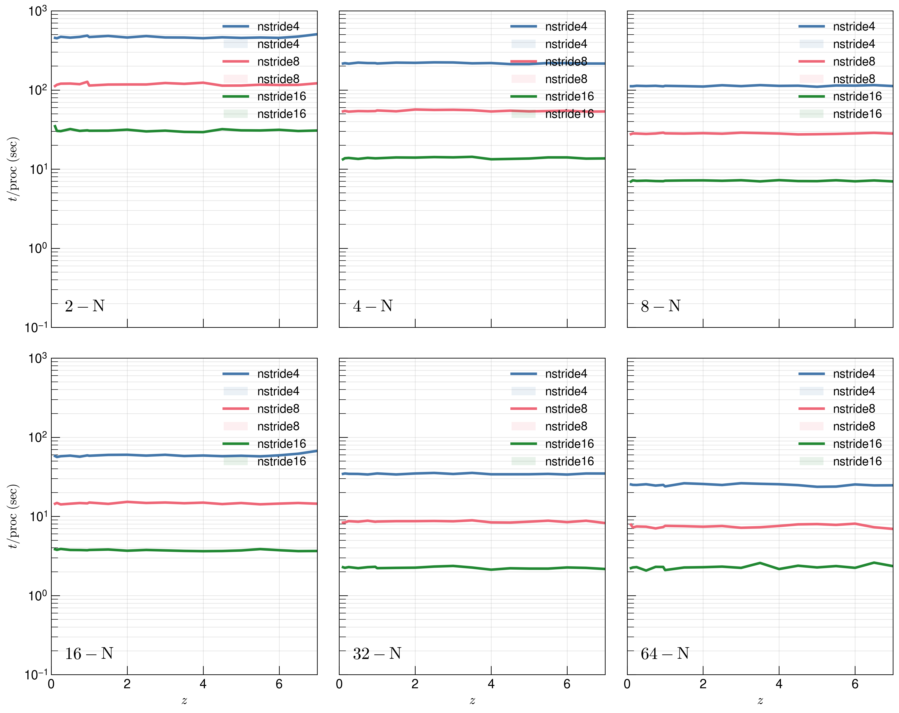
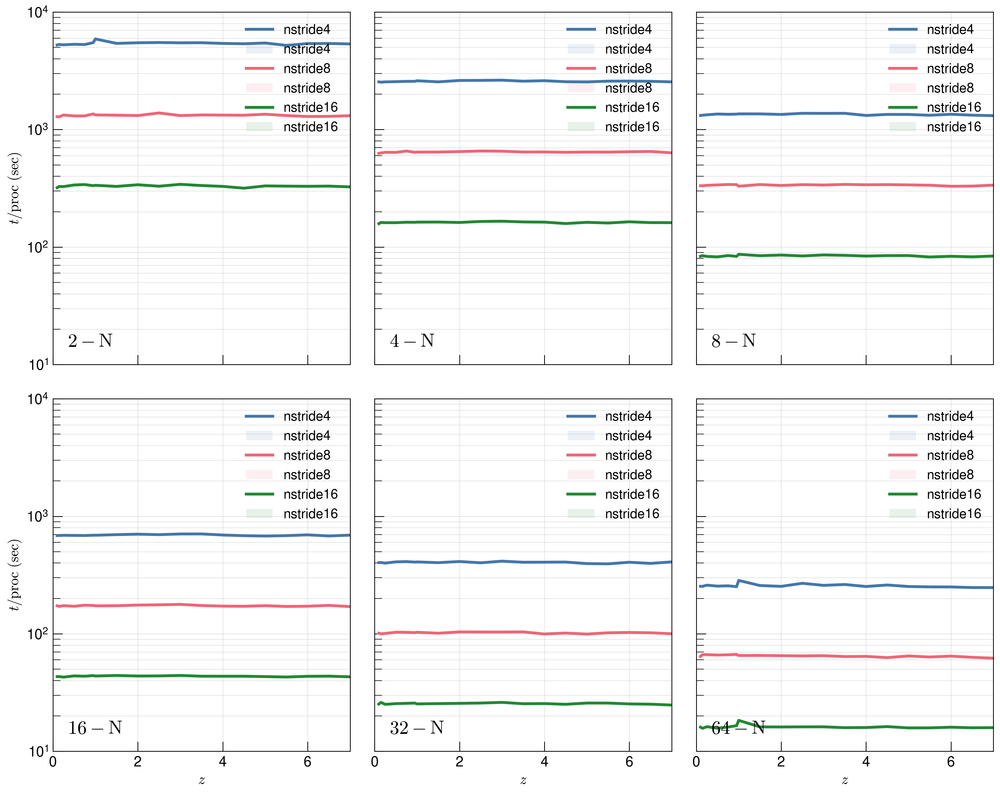
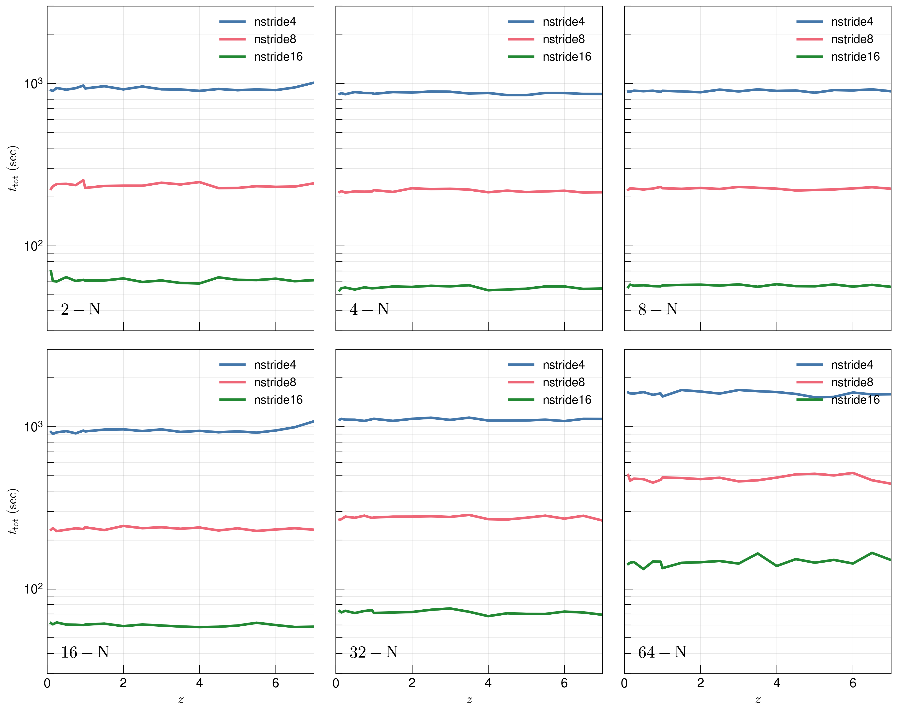
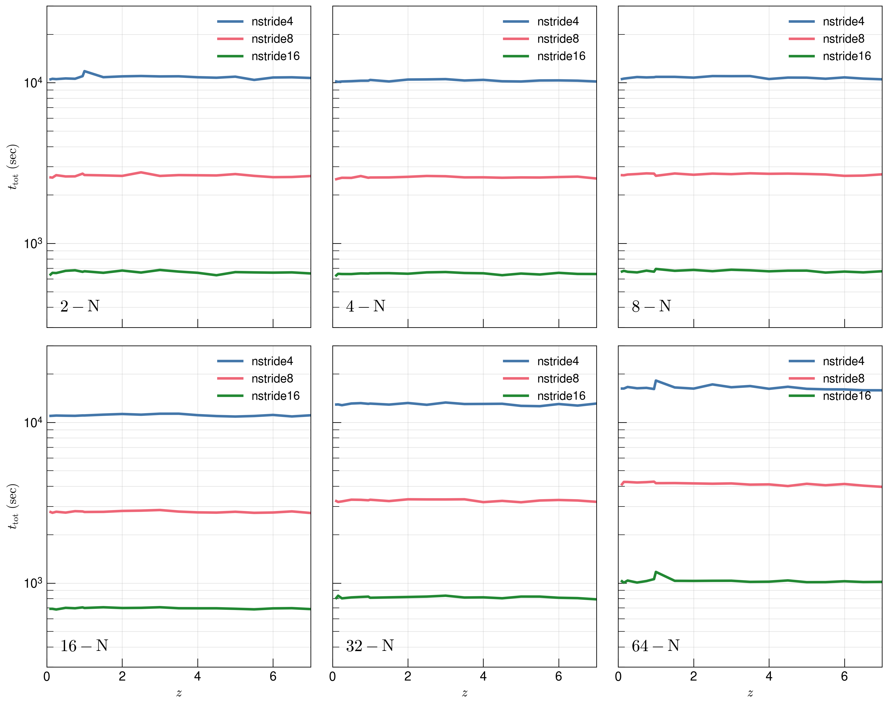
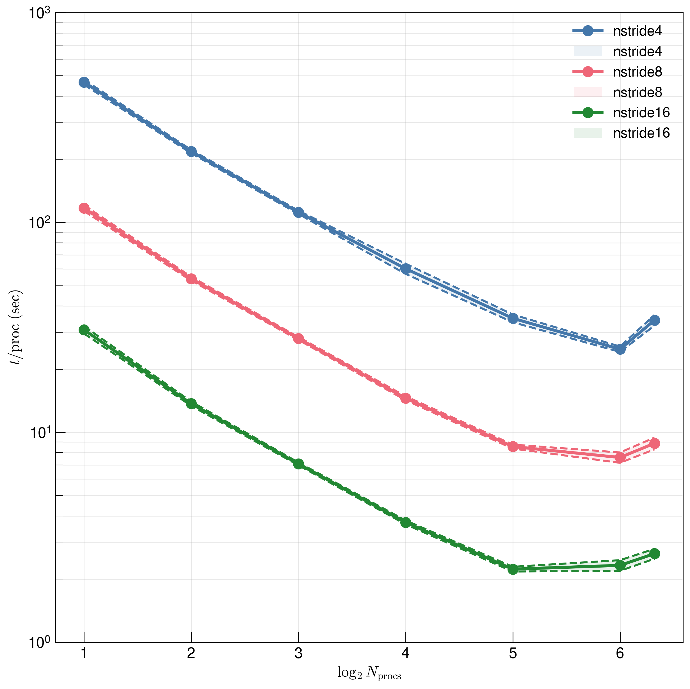
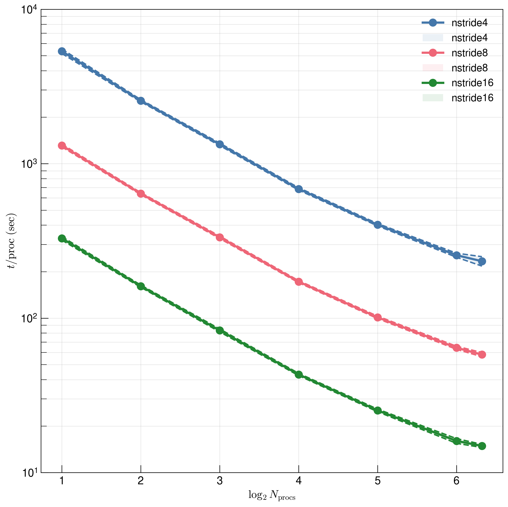
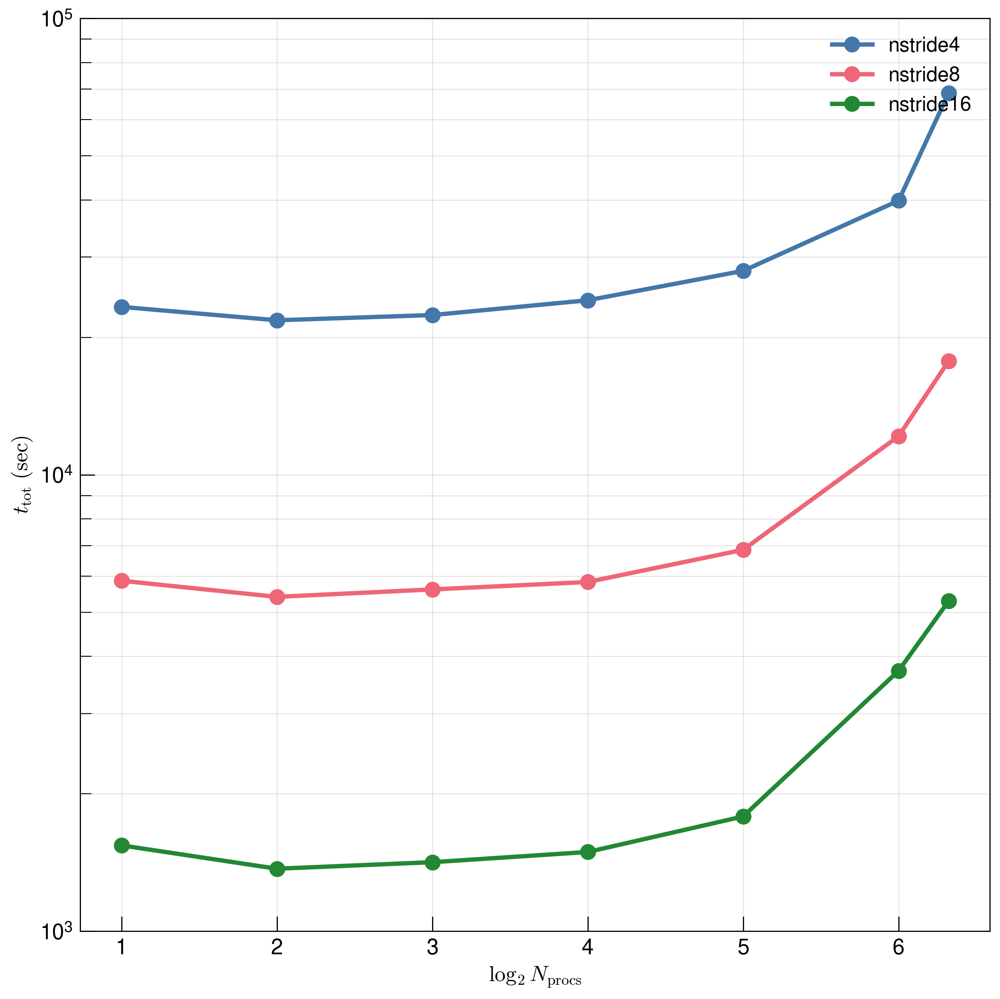
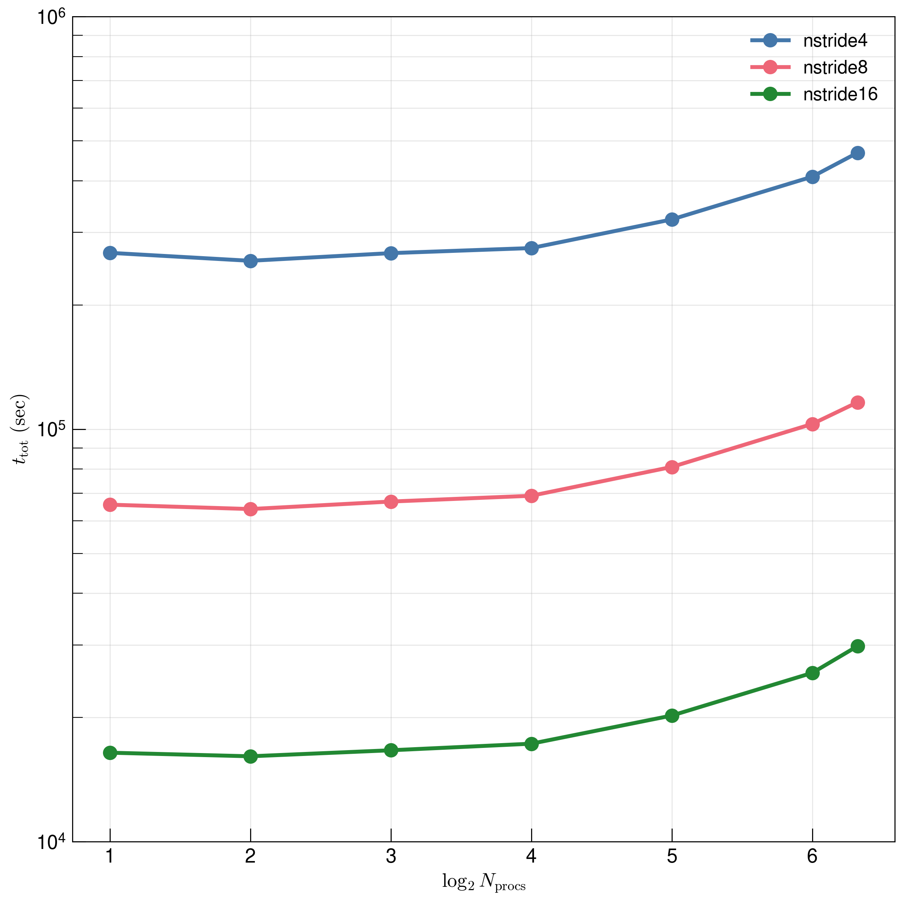

.. _study-gauss-speed-mpi:
Gaussian Optical Depth Speedup - MPI
=====

.. _email_diego: digarza@ucsc.edu

.. _Overview:
Overview
-----------

The calculation of the local optical depth for on-the-fly skewers are independent skewer-to-skewer. To help speedup the calculation, we use the python package `mpi4py <https://mpi4py.readthedocs.io/en/stable/index.html>`_ to parallelize the operation. The gaol of this study is to look at the time save of calculating the local optical depth along all three axis for every skewer using multiple processors.

We are also interested in seeing how the time savings vary with the number of skewers that are used in the calculation -- inputed into the Cholla param file with `n_stride`.

The code to generate this study is found `here <https://github.com/astrodiegog/cholla_lya_scripts/tree/speedup-study-mpi>`_.

This study was calculated on lux and the outputs can be found `/data/groups/comp-astro/digarza/optdepth_skewtest_mpi`.

To study these effects with respect to resolution and skewer count, we run a total of 6 :math:`L=50 h^{-1} \rm{Mpc}` simulations with the same `Planck 2018 <https://ui.adsabs.harvard.edu/abs/2024arXiv240403002D/abstract>`_ cosmology:

1. :math:`512^3` cells & `lya_skewers_stride=16` :math:`\rightarrow 3072` skewers
2. :math:`512^3` cells & `lya_skewers_stride=8` :math:`\rightarrow 12288` skewers
3. :math:`512^3` cells & `lya_skewers_stride=4` :math:`\rightarrow 49152` skewers
4. :math:`1024^3` cells & `lya_skewers_stride=16` :math:`\rightarrow 12288` skewers
5. :math:`1024^3` cells & `lya_skewers_stride=8` :math:`\rightarrow 49152` skewers
6. :math:`1024^3` cells & `lya_skewers_stride=4` :math:`\rightarrow 196608` skewers

We set skewer outputs at the following redshifts: 10. ,  9.5 ,  9. ,  8.5 ,  8. ,  7.5 ,  7. ,  6.5 ,  6. , 5.5 ,  5. ,  4.5 ,  4. ,  3.5 ,  3. ,  2.5 ,  2. ,  1.5 , 1. ,  0.95,  0.75,  0.5 , 0.25,  0.15, 0.1 , 0.05.

Timing Results
----------------------------------------

There are two different ways to compare the timing results: total time taken for the calculations and average time taken per processor for the calculations.

We track the time taken for a given processor to complete the calculations. A good check on the communication time that impacts the calculation is to sum the time for all of the processors. We first take a look at the average time per processor and the total summed time as a function of redshift

Average Time v Redshift -- :math:`512^3` cells
^^^^^^^^^^^^^^^^^^^^^^^^^^^^^^^^^^^^^^^^^^^^^^^

Average Time v Redshift -- :math:`1024^3` cells
^^^^^^^^^^^^^^^^^^^^^^^^^^^^^^^^^^^^^^^^^^^^^^^

Total Time v Redshift -- :math:`512^3` cells
^^^^^^^^^^^^^^^^^^^^^^^^^^^^^^^^^^^^^^^^^^^^^^^

Total Time v Redshift -- :math:`1024^3` cells
^^^^^^^^^^^^^^^^^^^^^^^^^^^^^^^^^^^^^^^^^^^^^^^

Discussion
^^^^^^^^^^^^

The average and total time taken does not really change as a function of redshift. What we can do is disregard the redshift dimension and average / sum along it. The following plots will show the average time per processor throughout the entire skewer calculations, and the total time taken for all of the processors and skewers.

Timing Results Against Processor Count
----------------------------------------

Average Time v N processors -- :math:`512^3` cells
^^^^^^^^^^^^^^^^^^^^^^^^^^^^^^^^^^^^^^^^^^^^^^^

Average Time v N processors -- :math:`1024^3` cells
^^^^^^^^^^^^^^^^^^^^^^^^^^^^^^^^^^^^^^^^^^^^^^^

Total Time v N processors -- :math:`512^3` cells
^^^^^^^^^^^^^^^^^^^^^^^^^^^^^^^^^^^^^^^^^^^^^^^

Total Time v N processors -- :math:`1024^3` cells
^^^^^^^^^^^^^^^^^^^^^^^^^^^^^^^^^^^^^^^^^^^^^^^

Discussion
^^^^^^^^^^^^

The general results for :math:`1024^3` cells are an order of magnitude greater than the results for :math:`512^3` cells. The general plateau at high processors is less prominent for :math:`1024^3` cells.

Conclusion
------------

The general conclusion is that using more processors eases the load so that the time per processor drops about a power law.

