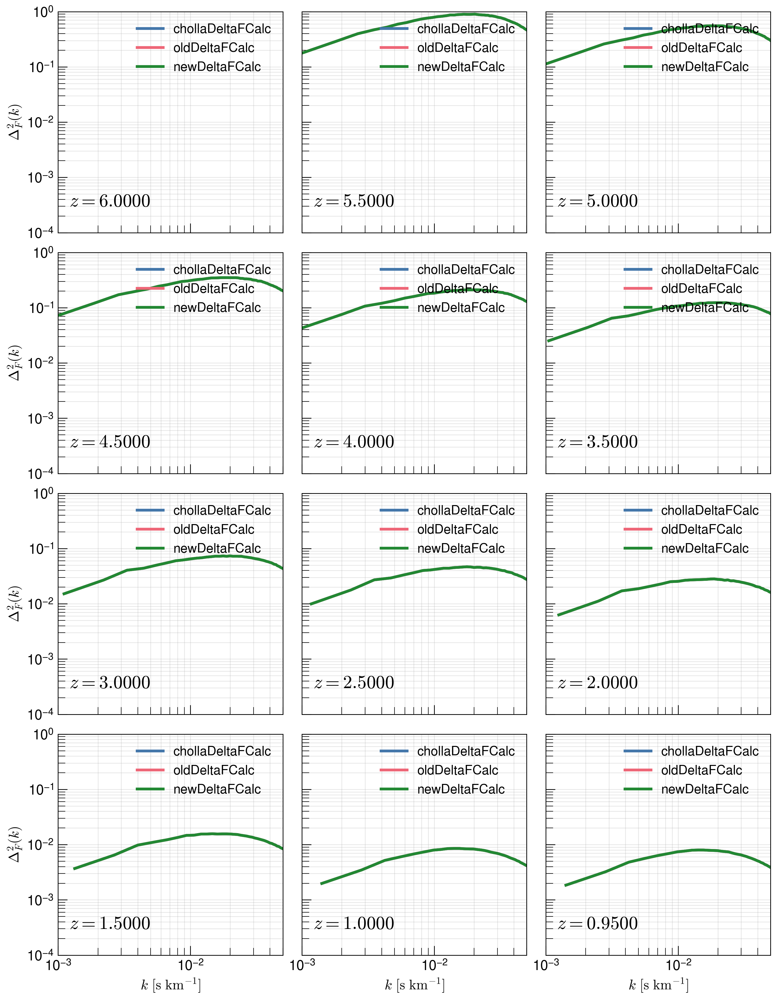
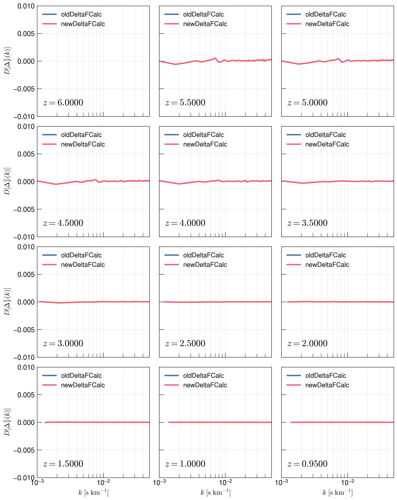
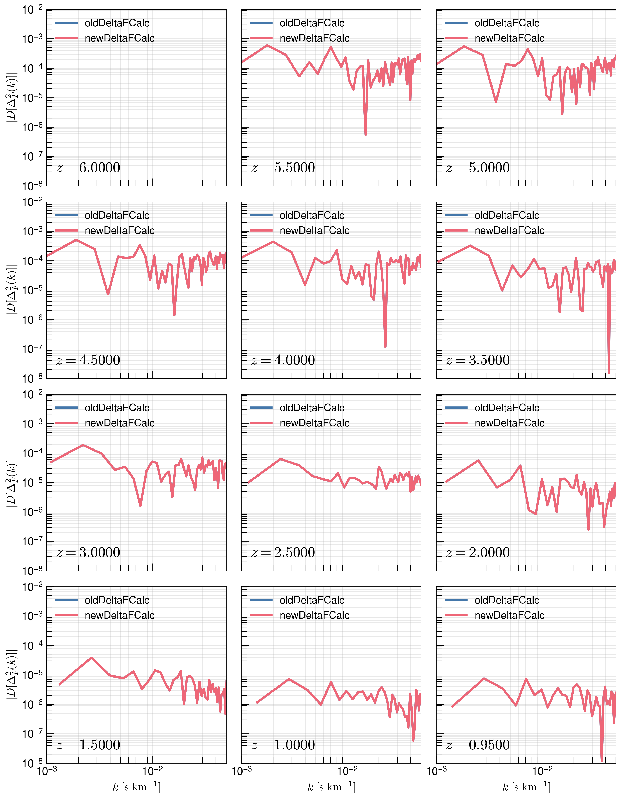
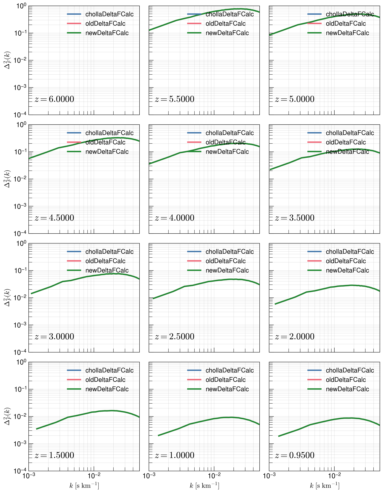
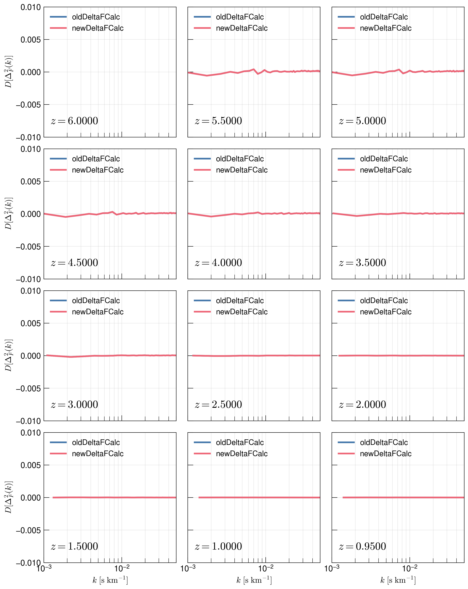
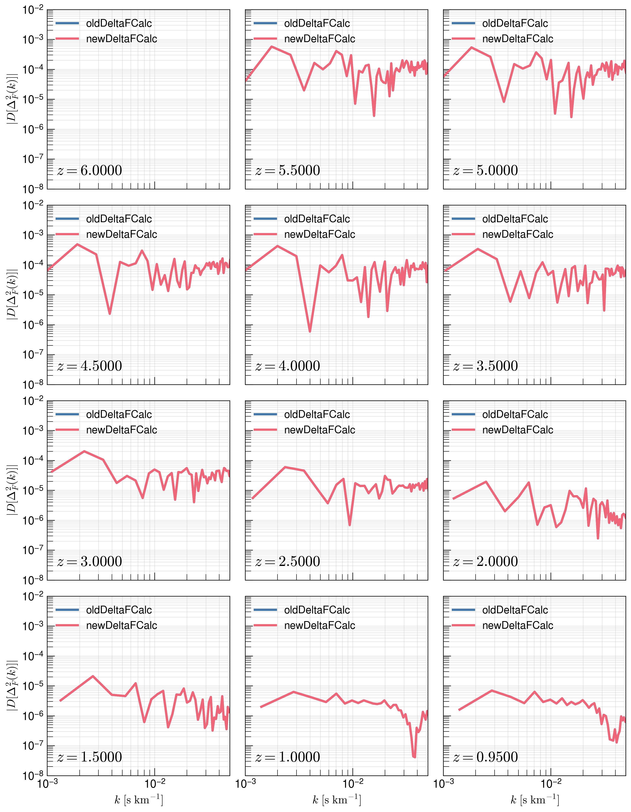

.. _study-powspec-deltaFcalc:
   Transmitted Flux Power Spectra - delta F Calculation
=====

.. _email_diego: digarza@ucsc.edu

.. _Overview:
Overview
-----------

The primary motivation for this study is that in the Cholla code, the flux overdensity is calculated without subtracting the mean. In theory we want to take the Fourier Transform of 

.. math::
    \delta_F (u) = \frac{F(u) - \bar{F}}{\bar{F}}

but in the code, we note that

.. code-block:: cpp
    delta_F[los_id] = skewers_transmitted_flux[skewer_id * n_los + los_id] / Analysis.Flux_mean_HI;

which corresponds to 

.. math::
       \delta_F (u) = \frac{F(u)}{\bar{F}}

The goal of this study is to see whether this actually makes a difference in the flux power spectra. 

The code to generate this study is found `here <https://github.com/astrodiegog/cholla_lya_scripts/tree/powspec-deltaFcalc>`_.

This study was calculated on lux and the outputs can be found `/data/groups/comp-astro/digarza/fluxpowspec_deltaFcalctest/`.

To study these effects with respect to resolution and skewer count, we run a total of 2 :math:`L=50 h^{-1} \rm{Mpc}` simulations with the same `Planck 2018 <https://ui.adsabs.harvard.edu/abs/2024arXiv240403002D/abstract>`_ cosmology:

1. :math:`512^3` cells & `lya_skewers_stride=4` :math:`\rightarrow 49152` skewers
2. :math:`1024^3` cells & `lya_skewers_stride=4` :math:`\rightarrow 196608` skewers

We set skewer outputs at the following redshifts: 10. ,  9.5 ,  9. ,  8.5 ,  8. ,  7.5 ,  7. ,  6.5 ,  6. , 5.5 ,  5. ,  4.5 ,  4. ,  3.5 ,  3. ,  2.5 ,  2. ,  1.5 , 1. ,  0.95,  0.75,  0.5 , 0.25,  0.15, 0.1 , 0.05.

Flux Power Spectrum Results
----------------------------

For each skewer output we calculate the local optical depth. We then calculate the flux power spectrum the "old" way of not subtracting the mean flux, and recalculate the flux power spectrum with the "new" way of subtracting the mean flux, and compare the difference with the "cholla" outputted flux power spectrum calculated on-the-fly.

For each simulation we show the dimensionless flux power spectrum and the relative difference of the "old" and "new" calculation method with respect to the on-the-fly calculation.

Simulation 1 Results -- :math:`512^3` cells & `lya_skewers_stride=4`
^^^^^^^^^^^^^^^^^^^^^^^^^^^^^^^^^^^^^^^^^^^^^^^^^^^^^^^^^^^^^^^^^^^^^

Simulation 2 Results -- :math:`1024^3` cells & `lya_skewers_stride=4`
^^^^^^^^^^^^^^^^^^^^^^^^^^^^^^^^^^^^^^^^^^^^^^^^^^^^^^^^^^^^^^^^^^^^^

Discussion
-----------

WELL wasn't that just fun. There is absolutely no difference between the "old" and "new" way of calculating the flux power spectra: subtracting the mean doesn't matter! I guess this makes sense because that relative difference is either centered at zero (subtracting mean) or one (not subtracting mean). The Fourier Transform of these relative differences should show up the same since the Fourier Transform of a constant should be zero -- it is a signal of zero frequency. To say that I spent too much time on this would be an understatement at how I feel right now, but hey ya live and ya learn.

