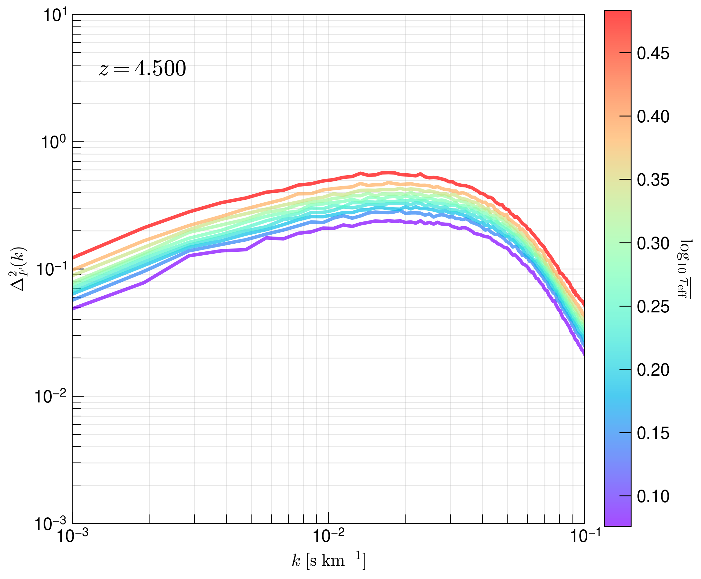
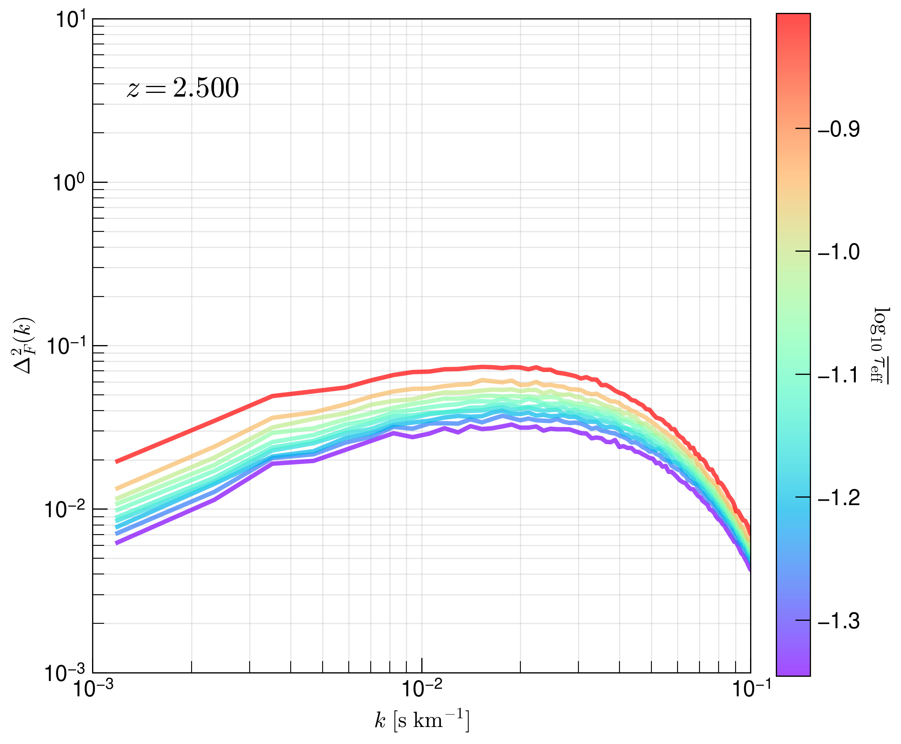
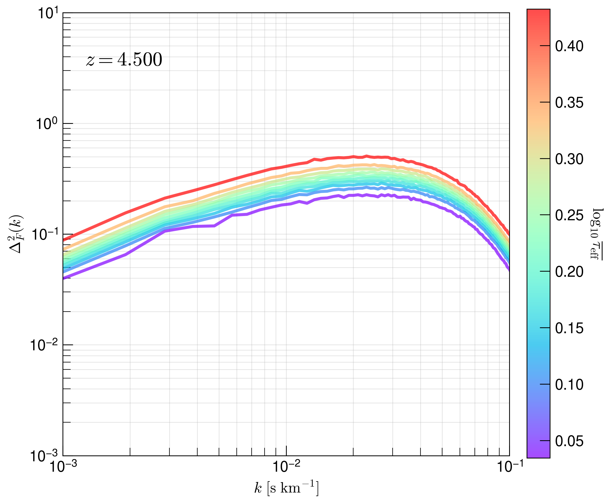
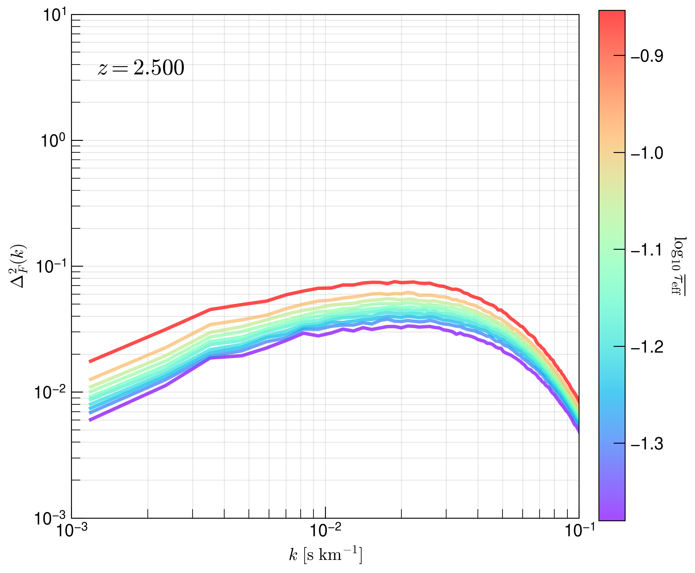

.. _study-powspec-optdepthbin:
Transmitted Flux Power Spectra - Binning by Median Optical Depth
=====

.. _email_diego: digarza@ucsc.edu

.. _Overview:
Overview
-----------

The primary motivation for this study is that we would like to use Cholla to study the expansion histories of different cosmologies. Comparing the transmitted flux power spectra won't be effective, as cosmologies may have pass differently before reionization impacts the intergalactic medium at a particular redshift. Instead, a probe we use to compare the expansion histories of different cosmologies is by grouping the transmitted flux power spectra by the median/effective optical depth of each skewer.

The goal of this study is to see whether this probe of distinguishing flux power spectra can show any cool relationships.

The code to generate this study is found `here <https://github.com/astrodiegog/cholla_lya_scripts/tree/powspec-optdepthbin>`_.

This study was calculated on lux and the outputs can be found `/data/groups/comp-astro/digarza/fluxpowspec_optdepthstack/`.

To study these effects with respect to resolution and skewer count, we run a total of 2 :math:`L=50 h^{-1} \rm{Mpc}` simulations with the same `Planck 2018 <https://ui.adsabs.harvard.edu/abs/2024arXiv240403002D/abstract>`_ cosmology:

1. :math:`512^3` cells & `lya_skewers_stride=4` :math:`\rightarrow 49152` skewers
2. :math:`1024^3` cells & `lya_skewers_stride=4` :math:`\rightarrow 196608` skewers

We set skewer outputs at the following redshifts: 10. ,  9.5 ,  9. ,  8.5 ,  8. ,  7.5 ,  7. ,  6.5 ,  6. , 5.5 ,  5. ,  4.5 ,  4. ,  3.5 ,  3. ,  2.5 ,  2. ,  1.5 , 1. ,  0.95,  0.75,  0.5 , 0.25,  0.15, 0.1 , 0.05.

Quantile Approach
--------------------

We assume that we have 3 key pieces of information:

1. Lower bound of the median optical depth
2. Upper bound of the median optical depth
3. Number of Quantiles

Given some skewer directory and a list of output skewer files to look at, the general flow of the code is as follows:

1. Sort all effective optical depths
2. Clip away effective optical depths outside provided bounds
3. Calculate the number of skewers in each quantile (roughly the same in each)
4. Create array with information to index into local optical depth calculation in skewer files for each quantile
5. Calculate the mean of the local fluxes for each quantile
6. Calculate the $k$-modes along each axis
7. Grab the local optical depth and calculate the flux power spectra along each axis for each quantile
8. Profit

Simulation 1 Results -- :math:`512^3` cells
^^^^^^^^^^^^^^^^^^^^^^^^^^^^^^^^^^^^^^^^^^^^^^^^^^^^^^^^^^^^^^^^^^^^^

We show the resulting plots at redshifts :math:`z=2.5, 4.5`

Simulation 2 Results -- :math:`1024^3` cells
^^^^^^^^^^^^^^^^^^^^^^^^^^^^^^^^^^^^^^^^^^^^^^^^^^^^^^^^^^^^^^^^^^^^^

We show the resulting plots at redshifts :math:`z=2.5, 4.5`

Discussion
^^^^^^^^^^^^^^^^^^^^^^^^^^^^^^^^^^^^^^^^^^^^^^^^^^^^^^^^^^^^^^^^^^^^^

At a given redshift, there is more power at a given :math:`k` mode when using skewers that have a larger effective optical depth. Grouping skewers that have a lower effective depth produces a flux power spectrum of less power. For the most optically thin regions, there are less deviations in the flux. As the Universe becomes more ionized in redshift, the optical depth of Lyman-alpha decreases, so we notice that the flux power spectrum dampens over redshifts.

